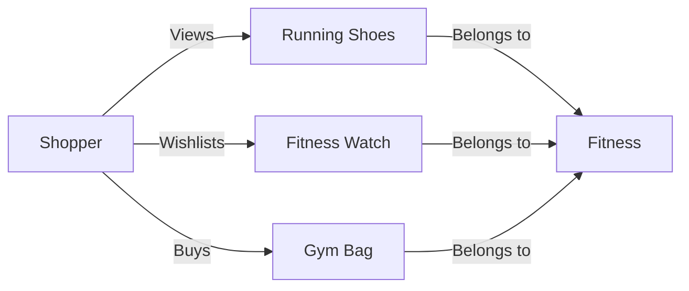
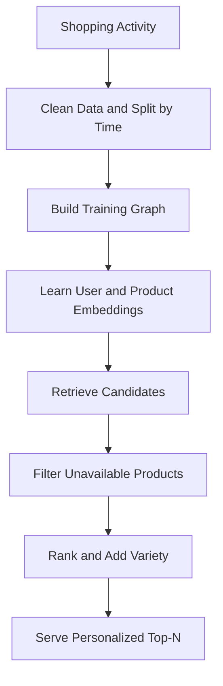
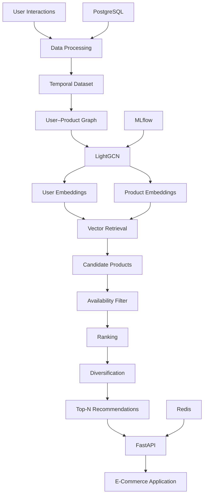

# 🛒 Shop Smarter with Graph Neural Networks

### From “You might like this” to “How did you know?” 🎯

An end-to-end e-commerce recommendation engine that learns from shopping behavior, discovers connections, and serves personalized product recommendations.

> **The GNN learns the relationships. The recommendation engine turns them into your next great find.**

**🚧 Status:** In development · **🐍 Language:** Python · **🧠 First model:** LightGCN

---

## 🌟 The Big Idea

Every click tells a story.

You browse running shoes, wishlist a fitness watch, and buy a gym bag. These interactions connect you to products—and to patterns shared by other shoppers.

Instead of treating everything as isolated data, we connect the dots with a **graph**.



**The result?** Recommendations based on relationships, not just bestsellers.

---

## ⚙️ How the Magic Works



| Stage            | What happens                                              |
| ---------------- | --------------------------------------------------------- |
| 🧹 **Prepare**   | Clean events and create leakage-safe, time-based datasets |
| 🕸️ **Connect**  | Build a user–product graph from training interactions     |
| 🧠 **Learn**     | Train LightGCN to capture shopping preferences            |
| 🔎 **Retrieve**  | Find promising products using vector search               |
| 🚦 **Filter**    | Apply stock, availability, and purchase rules             |
| 🏆 **Rank**      | Combine relevance with contextual signals                 |
| 🌈 **Diversify** | Avoid recommending twenty nearly identical shoes          |
| 🚀 **Serve**     | Return recommendations through an independent API         |

---

## 🧠 The Learning Recipe

### Different actions, different signals

These are **starting weights to experiment with**, not fixed truths.

| Interaction     | Initial weight |
| --------------- | -------------: |
| 👀 View         |              1 |
| 🖱️ Click       |              2 |
| 💖 Wishlist     |              3 |
| 🛍️ Add to cart |              4 |
| 💳 Purchase     |              5 |

Recent activity can receive more weight through time decay.

**First model:** LightGCN for user–product collaborative filtering.
**Later experiments:** GraphSAGE, GAT, and heterogeneous graphs.

User and product embeddings produce a preference score:

$$
s(u,i)=\mathbf{e}_u^\top\mathbf{e}_i
$$

Training uses **BPR loss** to encourage observed interactions to score above sampled unobserved items.

> **Important:** Unobserved does **not** automatically mean disliked.

---

## 🧊 New Here? No Problem.

| Situation                | Recommendation strategy                             |
| ------------------------ | --------------------------------------------------- |
| 👋 **New shopper**       | Popular products and available session signals      |
| 📦 **New product**       | Metadata-based retrieval and controlled exploration |
| 🔄 **Returning shopper** | Learned preferences plus recent activity            |

Plain LightGCN cannot directly use product text or images; those need a separate content model or a feature-aware extension.

---

## 🛠️ Tech Stack

### 🐍 Languages & Data

<p align="center">
  
</p>

### 🧠 Machine Learning & Graph Learning

<p align="center">
  
  
  
  
</p>

### 🚀 Backend & Storage

<p align="center">
  
</p>

### 🧪 Testing & Deployment

<p align="center">
  
</p>

| Purpose               | Technology                  |
| --------------------- | --------------------------- |
| 🐍 Data processing    | Pandas / NumPy              |
| 🧠 Graph learning     | PyTorch / PyTorch Geometric |
| 🔎 Vector retrieval   | FAISS                       |
| 🚀 Recommendation API | FastAPI                     |
| 🗄️ Storage           | PostgreSQL                  |
| ⚡ Caching             | Redis                       |
| 📊 Experiments        | MLflow                      |
| 🧪 Testing            | Pytest                      |
| 📦 Deployment         | Docker                      |

---

## 🔌 Simple Outside. Smart Inside.

```python
recommendations = recommender.recommend(
    user_id="U101",
    k=20
)
```

### Planned API

```http
GET /recommendations/U101?k=20
```

```json
{
  "user_id": "U101",
  "model_version": "lightgcn_v1",
  "recommendations": [
    {"product_id": "P501", "score": 0.932},
    {"product_id": "P103", "score": 0.891}
  ]
}
```

*Illustrative response; scores represent ranking signals, not purchase probabilities.*

---

## 📊 Does It Actually Recommend Better?

A fancy model only earns its place if it beats simpler alternatives.

| Evaluation         | What we check                                                            |
| ------------------ | ------------------------------------------------------------------------ |
| 🥊 **Baselines**   | Compare against popularity, item similarity, and collaborative filtering |
| 🎯 **Relevance**   | Recall@K, Precision@K, NDCG@K, and Hit Rate@K                            |
| 🌍 **Discovery**   | Catalog coverage and recommendation diversity                            |
| 🧪 **Live impact** | A/B-test clicks, cart additions, purchases, and revenue                  |
| ⚡ **Reliability**  | Monitor latency, errors, and embedding freshness                         |

> **No peeking into the future:** graphs, features, and popularity statistics must respect the prediction cutoff.

---

## 👥 Four People, One Recommendation Engine

| Owner                                    | Mission                                               |
| ---------------------------------------- | ----------------------------------------------------- |
| 🕸️ **Data & Graph Engineer**            | Clean data, create temporal splits, and build graphs  |
| 🧠 **GNN / ML Engineer**                 | Train models and generate embeddings                  |
| 🏆 **Retrieval & Ranking Engineer**      | Retrieve, filter, rank, and diversify products        |
| 🔌 **Integration & Evaluation Engineer** | Build the API, evaluate quality, and test reliability |

---

## 🗺️ Build Roadmap

| Phase              | Deliverable                                                         |
| ------------------ | ------------------------------------------------------------------- |
| 1️⃣ **Foundation** | Event pipeline, temporal splits, and baselines                      |
| 2️⃣ **Learning**   | User–product graph and LightGCN training                            |
| 3️⃣ **Discovery**  | Vector retrieval, filtering, and ranking                            |
| 4️⃣ **Serving**    | FastAPI integration and caching                                     |
| 5️⃣ **Validation** | Offline evaluation and performance tests                            |
| 6️⃣ **Production** | Versioned model bundles, monitoring, and retraining                 |
| 🔮 **Beyond**      | Feature-aware GNNs, multimodal signals, and session personalization |

---

## 🧩 System Architecture



---

## 💡 Our Philosophy

> **A GNN is the brain—not the whole shopping assistant.**

Great recommendations need clean data, useful representations, sensible rules, honest evaluation, and reliable serving.

### Less endless scrolling. More “that’s exactly what I wanted.” 🛍️

---

## 📌 Project Status

| Component                    | Status            |
| ---------------------------- | ----------------- |
| 🧹 Data preprocessing        | 🚧 In development |
| 🕸️ User–product graph       | 🚧 In development |
| 🧠 LightGCN                  | 🚧 In development |
| 🔢 Embedding generation      | 🚧 In development |
| 🔎 Vector retrieval          | ⏳ Planned         |
| 🏆 Ranking & diversification | ⏳ Planned         |
| 🔌 FastAPI service           | ⏳ Planned         |
| 📊 Offline evaluation        | ⏳ Planned         |
| 🐳 Docker deployment         | ⏳ Planned         |

---

## 🤝 Contributing

Contributions, experiments, and ideas are welcome.

If you're interested in graph-based recommendation systems, feel free to explore the project, open an issue, or submit a pull request.

---

## 📜 License

Built for **education and research**.

Add a formal license before public distribution.

---

<p align="center">
  <b>🧠 Graphs learn relationships. 🎯 Recommendations turn them into discoveries.</b>
</p>

<p align="center">
  Made with ❤️ and Graph Neural Networks
</p>
